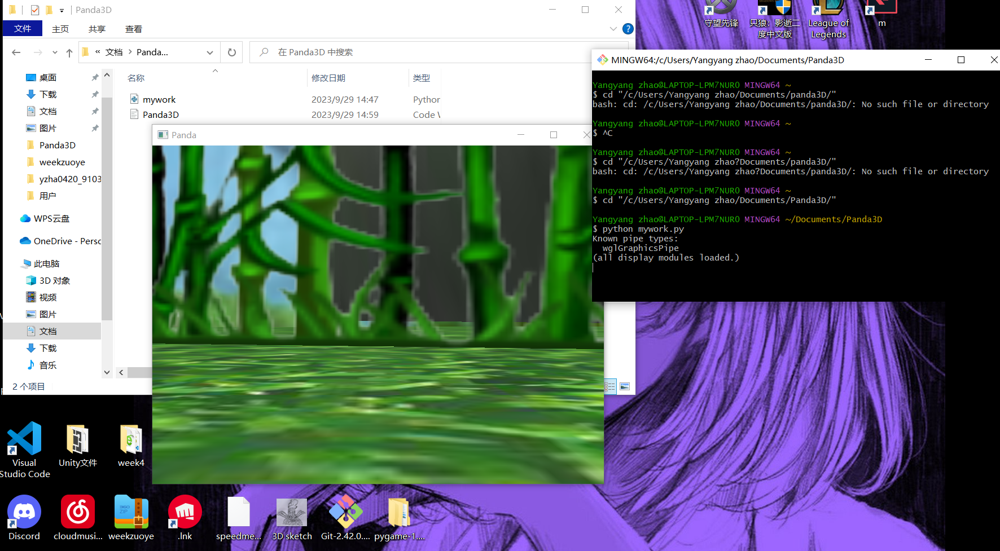

# yzha0420_9103_TU6
## Part 1: Imaging Technique Inspiration

### 1. Imaging Technique Choice:
I was inspired by the "bullet time" effect in the movie "The Matrix". This effect creates an illusion of time being frozen, with the camera moving around the subject while everything else remains still.

### 2. Discussion:
This technique offers a dramatic emphasis at crucial moments, giving the audience a complex, almost 3D perspective of a pivotal scene. I wish to incorporate it into my project to highlight critical turning points in my narrative. This immersive slow-motion panorama can act as an engaging tool, effectively capturing the audience's attention and emphasizing the significance of specific events.

### 3. Images:

---

## Part 2: Coding Technique Exploration

### 1. Coding Technique:
To mimic the "bullet time" effect, I would use 3D graphics libraries in Python `Panda3D`, combined with motion tracking capabilities.

### 2. Discussion:
Utilizing 3D graphics libraries would allow the creation of a controllable virtual camera that can move around a central subject. Motion tracking can be used to synchronize the rendered scene with the actual shoot, replicating the bullet time effect. By adjusting the frame rate and interpolating between frames, the desired slow-motion effect can be achieved.

### 3. Inspiration Source:
Python boasts a rich ecosystem of graphics and game libraries. Pairing them with motion tracking tools can effectively recreate the "bullet time" illusion.

### 4. Images and Sample Implementation:

[Matrix python](https://github.com/yangyangzha/yzha0420_9103_TU6/blob/main/mywork.py)
